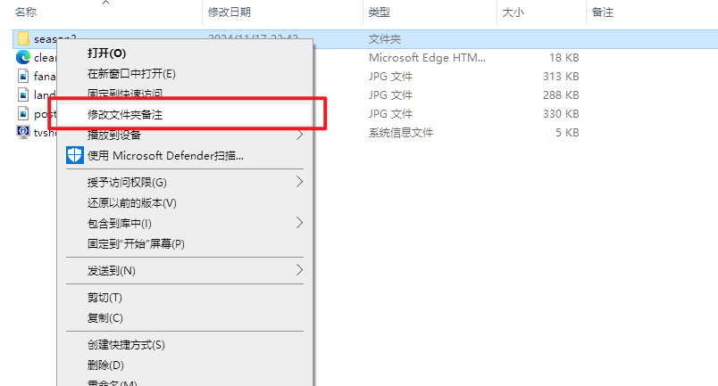
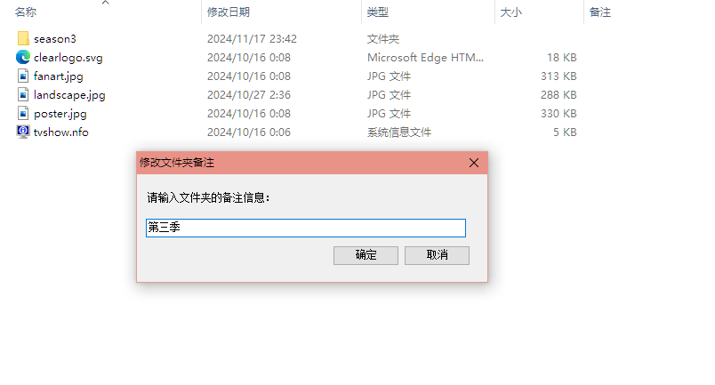
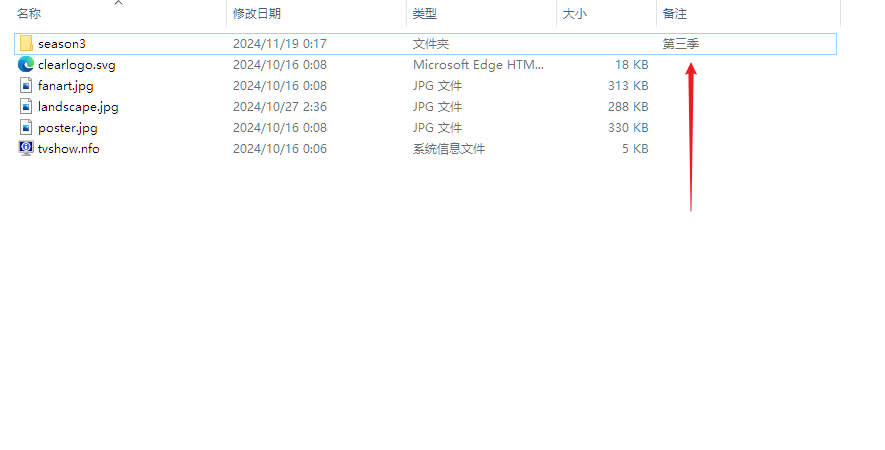

# windows 右键文件夹添加备注信息

---
# 📝 ModifyFolderComment

[](https://dotnet.microsoft.com/en-us/download/dotnet/8.0)[]()[]()[](LICENSE)[](https://github.com/WuJiaoJue/ModifyFolderComment/releases)







## 安装

1. 下载最新版本的安装程序（`install.exe`）。
2. 双击运行安装程序，按照提示完成安装。

## 文件

NEW !
> C# .Net 8.0 重构的修改文件夹注释


安装程序包含以下文件：

VBScript & PowerShell 版本	
- `ModifyFolderComment.exe`: 主程序文件。

- `RunModifyFolderComment.vbs`: 用于运行主程序的脚本文件。

- `AddContextMenuOption.reg`: 注册表文件，用于添加右键菜单选项。

.NET 8.0版本（推荐，支持实时刷新备注信息，需要.NET环境)	[](https://dotnet.microsoft.com/en-us/download/dotnet/8.0)

- `Program.cs`: 应用入口，处理参数与权限校验

- `FolderCommentForm.cs`: 主窗体，图形界面交互

- `DesktopIniManager.cs`: 读写 `desktop.ini`，管理注释文本

- `FolderRefresher.cs`: 通知系统刷新资源管理器显示状态

_`ModifyFolderComment.exe` 为 `ModifyFolderComment.ps1` 打包而成的可执行文件，不信任的自行下载 `ModifyFolderComment.ps1` 文件打包。_
> 打包命令
> VBScript & PowerShell 版本
>
> ```powershell
> Invoke-PS2EXE -InputFile "ModifyFolderComment.ps1" -OutputFile "ModifyFolderComment.exe" -NoConsole -requireAdmin
> ```
> .NET 8.0版本
> ```powershell
> dotnet publish -c Release -r win-x64 --self-contained false -p:PublishSingleFile=true
> ```


## 运行

在资源管理器中，右键单击文件夹，选择 "修改文件夹备注" 选项。在弹出的对话框中输入备注信息，然后单击 "确定" 或按回车。

## 卸载

要卸载 ModifyFolderComment 应用程序，请执行以下步骤：

1. 打开控制面板，选择 "程序和功能"。
2. 找到 "ModifyFolderComment" 项目，右键单击并选择 "卸载"。

卸载程序将自动删除所有安装的文件和注册表项。

## 打包与安装

- 用 Inno Setup 打开 install_script.iss，点击“编译”生成 install.exe。
- install.exe 会自动包含主程序和脚本，并注册右键菜单。
- 右键菜单注册表也可用 AddContextMenuOption.reg 手动导入。

> install_script.iss 关键片段：
> 
> VBScript & PowerShell 版本
> ```ini
> [Files]
> Source: "ModifyFolderComment.exe"; DestDir: "{app}"
> Source: "RunModifyFolderComment.vbs"; DestDir: "{app}"
> [Registry]
> Root: HKCR; Subkey: "Directory\shell\ModifyFolderComment"; ValueData: "修改文件夹备注"
> Root: HKCR; Subkey: "Directory\shell\ModifyFolderComment\command"; ValueData: "wscript.exe \"{app}\RunModifyFolderComment.vbs\" \"%1\""
> ```
> .NET 8.0版本
> ```ini
> [Files]
> Source: "bin\Release\net8.0-windows\win-x64\publish\ModifyFolderComment.exe"; DestDir: "{app}"; Flags: ignoreversion
> 
> [Icons]
> Name: "{group}\ModifyFolderComment"; Filename: "{app}\ModifyFolderComment.exe"
> 
> [Registry]
> Root: HKCR; Subkey: "Directory\shell\ModifyFolderComment"; ValueType: string; ValueName: ""; ValueData: "修改文件夹备注"; Flags: uninsdeletekey
> Root: HKCR; Subkey: "Directory\shell\ModifyFolderComment\command"; ValueType: string; ValueName: ""; ValueData: """{app}\ModifyFolderComment.exe"" ""%1"""; Flags: uninsdeletevalue
> ```

---

## 已知问题
- ~~添加或修改备注后无法及时在资源管理器中看到更新，通常需要等待几十秒到一分钟左右，系统才会自动更新显示内容~~

  ~~修改文件夹名称|移动desktop.ini文件到其他位置|触发资源管理器刷新 等操作均无法稳定触发有效更新； 重启资源管理器可以有效触发更新但属于破坏性操作风险太高不予考虑；~~
    > 2025-07-12 更新：✅ **已在 .NET 版本优化**，仅在部分测试系统版本上测试，添加或修改备注后可以立即在资源管理器中看到更新。
  > 若项目存在问题，请卸载并安装 VBScript & PowerShell 版本，并在项目中提交 issue。
